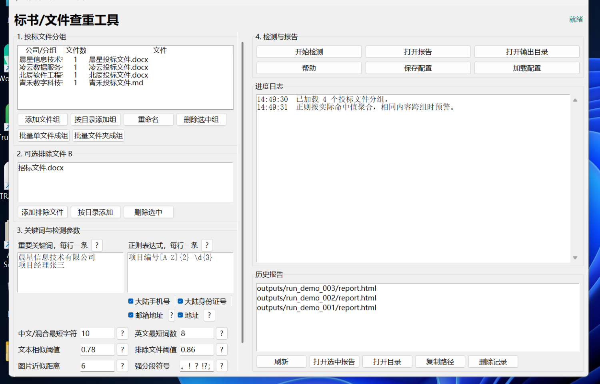
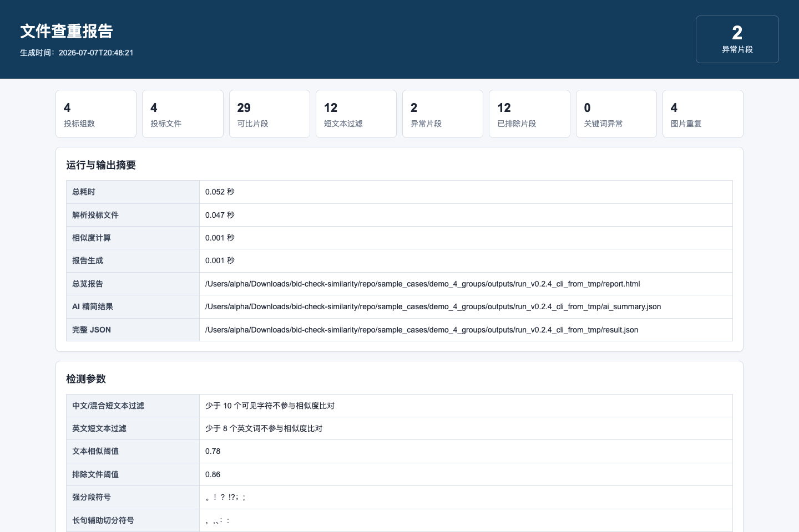
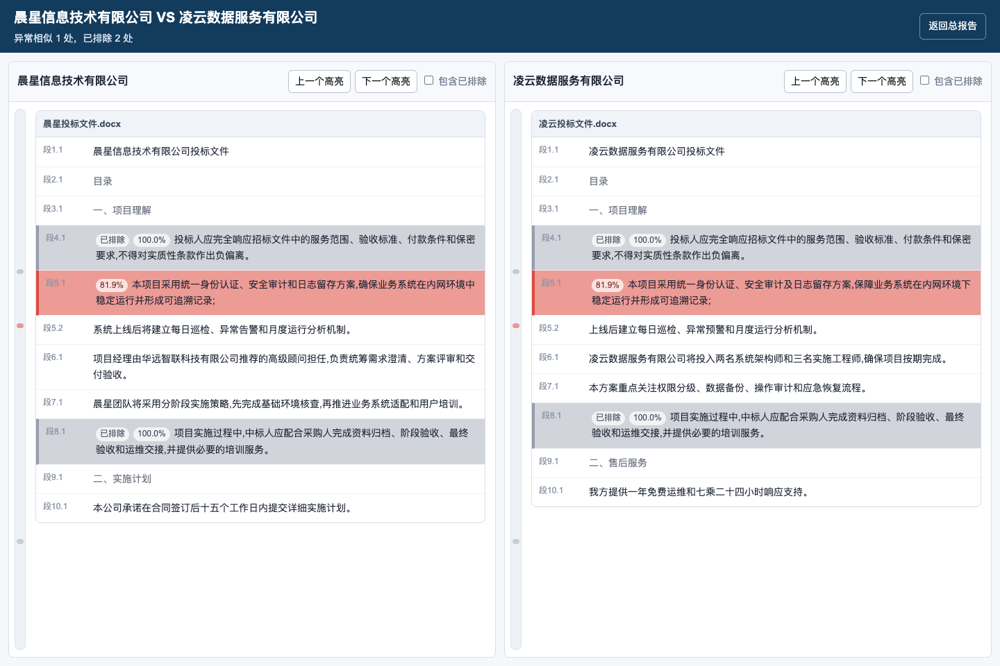

# 标书/文件查重工具

本项目是一个本地离线运行的标书/文件查重工具，支持桌面 GUI、命令行 CLI 和 Agent Skill。桌面版和源码 CLI 可按公司/投标单位分组导入 `.docx`、`.doc`、`.wps`、`.pdf`、`.md`、`.txt` 文件；Agent Skill 为轻量版，支持 `.docx`、`.doc`、`.wps`、`.md`、`.txt`，不内置 PDF/OCR 依赖。工具会检测跨组相似文本、共享关键词/正则、重复图片，并生成可在内网离线打开的 HTML 报告。

## 软件截图







## 主要功能

- 多组投标文件两两查重，同一组内文件不会互相比对。
- 支持可选排除文件，例如招标文件、模板文件、统一格式要求。
- 普通关键词与正则表达式分栏配置；普通关键词跨组出现即提示，正则仅在同一实际命中值跨 2 个及以上公司组出现时提示。
- 内置中国大陆手机号、中国大陆身份证、邮箱地址、中文地址四种正则预设，默认全部启用，也可逐项取消勾选。
- 支持短文本过滤、文本相似阈值、排除文件阈值、分段符号等参数设置。
- 支持 `.doc/.wps` 自动转换：Windows 下按 WPS、Microsoft Office、LibreOffice 顺序尝试，Linux/macOS 下使用 LibreOffice。
- 桌面版和源码 CLI 支持 PDF 文本读取：可复制文本的 PDF 直接解析；桌面打包版默认内置 PaddleOCR/PP-OCRv6 medium OCR，用于处理扫描版 PDF。
- 生成 `report.html`、`ai_summary.json`、`result.json` 和按组对生成的 `compare_*.html` 左右对照页，完整结果默认全量写入。
- HTML 报告的 CSS/JS 均内嵌，不依赖 CDN，适合内网离线使用。

## 桌面版

从 Release 页面下载对应平台的桌面版：

```text
BidCheckSimilarity-v版本号-Windows-x64.exe
BidCheckSimilarity-v版本号-macOS-arm64.zip
```

macOS 下载 zip 后解压，打开 `标书文件查重工具.app`。如果系统提示来自互联网下载，可在 Finder 右键选择“打开”。

运行后按界面步骤操作：

1. 添加至少 2 个投标文件分组。
   - “添加文件组”：一次选择同一家公司的一批文件。
   - “按目录添加组”：选择一个公司目录，递归导入该公司文件。
   - “批量单文件成组”：一次选择多个文件，每个文件自动作为一个公司/分组。
   - “批量文件夹成组”：选择包含多个公司文件夹的上级目录，每个直接子文件夹及其子目录自动作为一个公司/分组。
2. 可选添加排除文件 B。
3. 可选在左侧填写普通关键词、在右侧填写正则表达式；手机号、身份证、邮箱和地址预设默认勾选。
4. 调整短文本过滤、相似度阈值、排除文件阈值、分段符号等参数；每个参数右侧 `?` 可查看说明。
5. 点击“开始检测”，完成后会自动打开 `report.html`。

仓库自带可直接试用的示例：`sample_cases/demo_4_groups`。它包含晨星、凌云、北辰、青禾 4 家投标文件和 1 个招标文件；关键词可填写 `晨星`、`凌云`、`北辰`、`青禾`。

## 命令行

推荐使用 Python 3.8+：

```powershell
python -m pip install -e .
python -m checksim.cli --config examples\case.example.json --output outputs\run_demo
```

不指定 `--output` 时，CLI 默认把结果写到当前工作目录的 `outputs/run_时间戳`，适合在 opencode 等 agent 的项目目录中直接运行。

也可以直接启动 GUI：

```powershell
python run_app.py
```

## Agent Skill 安装

本仓库包含 `bid-check-similarity` Skill。推荐通过 npx 安装到对应 agent 的 skills 目录：

```bash
npx github:cwyalpha/bid-check-similarity --target /path/to/agent/skills
```

如果环境变量中已经配置了 `AGENT_SKILLS_DIR`，也可以省略 `--target`：

```bash
AGENT_SKILLS_DIR=/path/to/agent/skills npx github:cwyalpha/bid-check-similarity
```

如果既不传 `--target`，也不设置 `AGENT_SKILLS_DIR`，安装器会默认写入当前命令行目录下的 `./skills`。

安装完成后，根据提示安装 Python 依赖：

```bash
python -m pip install -r /path/to/agent/skills/bid-check-similarity/scripts/requirements.txt
```

Skill 会调用同一套 `checksim` 核心代码和 CLI，适配 Windows、macOS 与 Linux。安装后的 Skill 是自包含的：`scripts/vendor/checksim` 内置核心代码副本，运行时不依赖仓库根目录或外部脚本。

Skill 版和桌面/源码 CLI 保持同构的配置结构、分组逻辑、排除文件、关键词规则、相似度算法和报告输出；差异只在文件格式能力上：

- Skill 轻量版支持 `.docx`、`.doc`、`.wps`、`.md`、`.txt`，不支持 `.pdf`。
- Skill 不安装 `pypdf`、PaddleOCR、onnxruntime、pypdfium2，也不带 OCR 模型，因此体积更小。
- Windows 处理 `.doc/.wps` 时可使用 WPS/Office/LibreOffice；macOS/Linux 处理旧格式文件需要 LibreOffice `soffice`。
- 需要查 PDF 或扫描件时，请使用桌面版/源码 CLI，或先把 PDF 转成 `.docx`、`.txt`、`.md` 后再交给 Skill。

## 配置示例

```json
{
  "groups": [
    {
      "name": "A公司",
      "files": ["D:/cases/A公司/投标文件.docx"]
    },
    {
      "name": "B公司",
      "files": ["D:/cases/B公司/投标文件.md", "D:/cases/B公司/补充材料.wps", "D:/cases/B公司/说明.txt"]
    }
  ],
  "exclude_files": ["D:/cases/招标文件.docx"],
  "keywords": ["晨星", "凌云", "北辰", "青禾"],
  "regex_keywords": ["项目编号[A-Z]{2}-\\d{3}"],
  "regex_presets": {
    "china_mobile": true,
    "china_id_card": true,
    "email": true,
    "china_address": true
  },
  "options": {
    "min_chars": 10,
    "min_words": 8,
    "similarity_threshold": 0.78,
    "exclude_threshold": 0.86,
    "sentence_delimiters": "。！？!?；;",
    "soft_delimiters": "，,、：:",
    "similarity_backend": "local_ngrams",
    "image_ahash_distance": 6,
    "legacy_conversion_timeout": 120,
    "soffice_path": ""
  }
}
```

`keywords` 是普通字面量关键词；`regex_keywords` 每项是一条正则表达式，不需要 `re:` 前缀。为兼容旧配置，`keywords` 中已有的 `re:` 规则仍可继续使用。

正则告警按“实际命中值”聚合。例如手机号规则在 A 公司命中 `13800138000`、B 公司命中 `13900139000` 时不会告警；只有同一个号码出现在 2 个及以上公司组时才告警。四个 `regex_presets` 默认均为 `true`，即使配置中省略该字段也会启用。短文本过滤只影响相似度比对，不影响关键词/正则检测。

桌面版/源码 CLI 如需处理 PDF，可在 `files` 中加入 `.pdf` 文件，并按需设置 PDF 相关参数：

- `pdf_ocr_mode`: `auto` 表示文本层不足时才尝试 OCR；`always` 表示强制 OCR；`off` 表示不使用 OCR。
- `pdf_ocr_lang`: OCR 语言，默认 `ch`，可按 PaddleOCR 支持语言调整。
- `pdf_min_text_chars`: 判断 PDF 文本层是否足够的可见字符阈值，默认 `20`。
- `pdf_ocr_engine`: 默认 `onnxruntime`。
- `pdf_ocr_det_model` / `pdf_ocr_rec_model`: 默认使用 PP-OCRv6 medium 检测和识别模型，避免误用 PaddleOCR-VL。

Agent Skill 轻量版不会读取 `.pdf`，也不会使用上述 PDF/OCR 参数。

## 报告说明

每次检测会生成：

- `report.html`：总览报告，包含统计、参数、两两比对、关键词异常、图片重复和明细。
- `compare_*.html`：两组文件左右对照页，支持点击高亮片段跳转到对侧对应片段。
- `ai_summary.json`：给 AI/Agent 优先阅读的精简结果，包含统计、输出路径、组对摘要、代表性重复片段、关键词/正则重复值异常和图片重复样例。
- `result.json`：完整结构化结果，包含全量相似片段、关键词异常、图片重复和统计信息。

`ai_summary.json` 用于快速判断是否需要人工复核；它不会替代全量结果。需要逐条追溯时，请打开 `report.html`、对应 `compare_*.html` 或读取 `result.json`。

左右对照页中，高亮颜色越深表示相似度越高；已排除片段颜色更淡。左右两栏可独立滚动，并支持“上一个/下一个高亮”导航。

## 开发与打包

运行测试：

```powershell
python -m unittest discover -s tests -v
```

同步 Skill 内置核心代码：

```powershell
python scripts\sync_skill_vendor.py
```

性能 smoke 会临时生成 4 组 10 万字符级 Markdown 样本，不会提交大文本：

```powershell
python scripts\perf_smoke.py --mode cli --groups 4 --chars-per-file 100000
python scripts\perf_smoke.py --mode skill --groups 4 --chars-per-file 100000
```

构建 Windows 单文件 exe：

```powershell
powershell -ExecutionPolicy Bypass -File .\build_exe_py38.ps1
```

输出文件：

```text
dist\标书文件查重工具.exe
```

构建 macOS 桌面版：

```bash
./build_macos.sh
```

默认 macOS/Windows 打包会把 PP-OCRv6 medium ONNX 模型放入程序。若只想构建轻量版，可设置：

```bash
CHECKSIM_BUNDLE_OCR=0 ./build_macos.sh
```

输出文件：

```text
release/BidCheckSimilarity-v版本号-macOS-arm64.zip
```

## Star History

<a href="https://www.star-history.com/?repos=cwyalpha%2Fbid-check-similarity&type=date&legend=top-left">
 <picture>
   <source media="(prefers-color-scheme: dark)" srcset="https://api.star-history.com/chart?repos=cwyalpha/bid-check-similarity&type=date&theme=dark&legend=top-left&sealed_token=ysHXtLz_97_JsJoeUPv4kbmOZfMMldTldUp6J-1dkVF9WL8AMg_VsjhhzFcvxy2cJB9O7D-k05Pcn1UqvGJ1wX0Keas5W5eSl5DMmPp1WUUMYpQWXy21cV_vG4ia-JV8mYf3UEwoe1xl2QNUSfKwlZQU8j8iL7iMvPBYHaqL-2ftPCJU0tw1Cxz9IFXG" />
   <source media="(prefers-color-scheme: light)" srcset="https://api.star-history.com/chart?repos=cwyalpha/bid-check-similarity&type=date&legend=top-left&sealed_token=ysHXtLz_97_JsJoeUPv4kbmOZfMMldTldUp6J-1dkVF9WL8AMg_VsjhhzFcvxy2cJB9O7D-k05Pcn1UqvGJ1wX0Keas5W5eSl5DMmPp1WUUMYpQWXy21cV_vG4ia-JV8mYf3UEwoe1xl2QNUSfKwlZQU8j8iL7iMvPBYHaqL-2ftPCJU0tw1Cxz9IFXG" />
   
 </picture>
</a>
